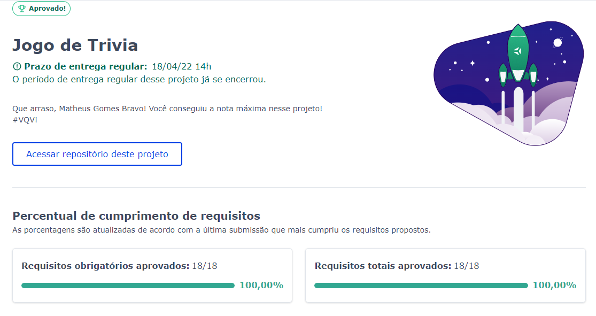

# Trivia

Projeto feito em grupo enquanto estudava na [Trybe](https://www.betrybe.com/), utilizando a API OpentDB, React, Redux e Styled-Components no módulo de front-end. Coberto com 100% dos testes da Trybe.

Foi desenvolvido um jogo de perguntas e respostas baseado no jogo Trivia. Desenvolvendo em grupo suas funcionalidades de acordo com as demandas definidas em um quadro Kanban.

É possível:
- Logar no jogo e, se o email tiver cadastro no site [Gravatar](https://pt.gravatar.com), ter sua foto associada ao perfil da pessoa usuária.
- Acessar a página referente ao jogo, onde é possível escolher uma das respostas disponíveis para cada uma das perguntas apresentadas. A resposta deve ser marcada antes do contador de tempo chegar a zero, caso contrário a resposta deverá ser considerada errada.
- Ser redirecionada, após 5 perguntas respondidas, para a tela de score, onde o texto mostrado depende do número de acertos.
- Visualizar a página de ranking, se quiser, ao final de cada jogo.

## Instalando o Trivia

Clone o repositório:
```
git clone git@github.com:matheusgb/trivia-react-redux.git
```
Entre na pasta do repositório:
```
cd trivia-react-redux
```
Instale as dependências:
```
npm install
```
Inicie a aplicação:
```
npm start
```

## Membros do Grupo

[Matheus Gomes](https://www.linkedin.com/in/matheusgb/) <br>
[Diogo Martini](https://www.linkedin.com/in/dmpdev/) <br>
[Leonardo Coelho](https://www.linkedin.com/in/leonardocoel/) <br>
[Yuri Villanueva](https://www.linkedin.com/in/yuri-villanueva-17532910b/) <br>
[Pérsio Pereira](https://www.linkedin.com/in/persio-pereira/)



